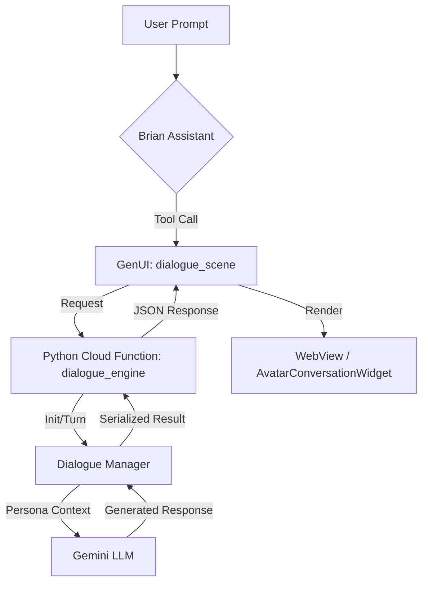
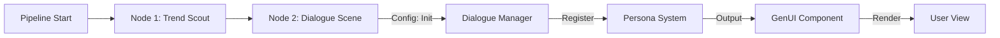

# DialogLab Integration Walkthrough

This document provides a technical walkthrough of the DialogLab integration within InhausBrain, including execution flows, testing instructions, and sample prompts.

---

## 🏗 System Architecture & Flows

### 1. Dialogue Execution Flow
This flow describes how a user interaction triggers a multi-party dialogue turn.



### 2. ADK Node Processing
How the Dialogue Scene node is handled in the Pipeline execution.



---

## 🧪 Testing Instructions

### Track 1: Core Engine (Python)
To verify the backend logic:
1.  **Local Script**: Run `python3 test_dialogue_local.py` in the root directory.
    - Expected: Output showing successful `Init` status and a mocked `Turn` response.
2.  **Cloud Function**: Use the Firebase Emulator or Postman to call the `dialogue_engine` endpoint.
    - Path: `POST /dialogue_engine`
    - Payload: 
      ```json
      {
        "action": "init",
        "flow_definition": { "start_node_id": "start", "nodes": [] },
        "personas": [{"id": "p1", "name": "Agent"}]
      }
      ```

### Track 2: Visualization (Flutter)
To verify the UI rendering:
1.  **WebView Check**: Ensure `webview_flutter` is correctly initialized on the target platform (iOS/Android/Web).
2.  **GenUI Trigger**: Use a sample prompt in the Brian overlay that triggers the `gen_ui_component` tool with `component_type: dialogue_scene`.

---

## 💬 Sample Prompts

### 1. Simple Multi-Party Initialization
> "Brian, I want to simulate a conversation between a skeptical Investor and a passionate Founder. Initialize a dialogue scene for this."

### 2. Persona-Specific Turn
> "Ask the Investor what their main concern is regarding our Q3 scalability."

### 3. Integrated ADK Workflow (For Brian)
> "Run the 'Client Pitch Simulation' pipeline and show me the strategist's opening argument in a dialogue scene."

---

## 🔧 Technical Reference
- **Backend**: `functions-python/dialogue_manager.py` (Core Logic)
- **Frontend**: `lib/features/assistant/presentation/widgets/gen_ui/dialogue_scene_widget.dart`
- **Bridge**: `lib/core/tools/gen_ui_tools.dart` (Schema definition)

---
**Status**: Integrated & Verified
**Version**: 1.4-safe
