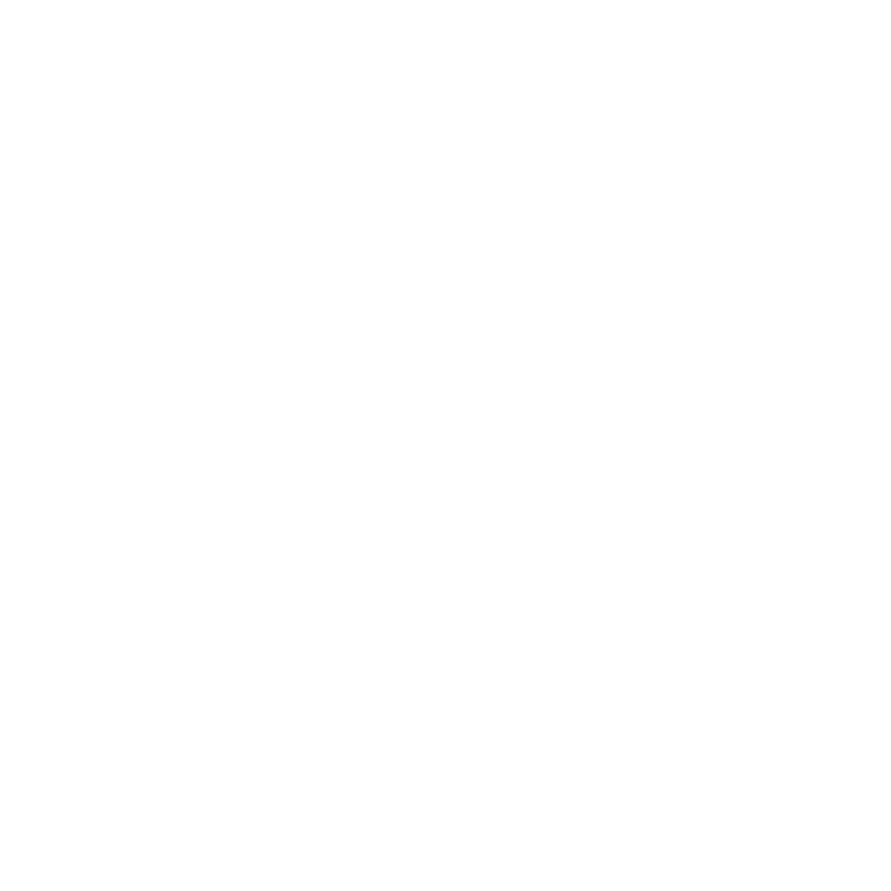

# Inhaus Brain - Agentic Workflow Management

**Inhaus Brain** is a premium, agent-led workflow orchestration platform designed for modern agencies. It leverages on-device AI and a human-in-the-loop architecture to automate campaign research, visual strategy, and creative execution.



## 🚀 Vision
To empower human creators with AI agents that handle the heavy lifting of research and planning, while maintaining high-quality standards through intuitive approval loops.

## ✨ Key Features

### 🧠 Hybrid Multi-Modal AI Engine
The Inhaus Brain intelligently coordinates a suite of specialized models via its **Hybrid Tiering Engine**:
- **Gemma / Gemini Pro**: Text-based reasoning and strategic analysis.
- **Imagen 3**: High-fidelity production imagery for concepts.
- **Veo**: SOTA video asset generation directly in the Workbench.
- **Lyria**: Advanced music and soundtrack composition for campaigns.
- **Nano Banana 🍌**: Agentic visual refinement and image editing.
- **Multi-Model Sovereignty**: Support for **OpenAI (GPT-4o)**, **Anthropic (Claude 3.5 Sonnet)**, **xAI (Grok Beta)**, **Eleven Labs (Voice)**, **Runway (Video)**, and **Midjourney** via BYOK (Bring Your Own Keys).
- **Edge Fallback**: Uses Chrome Built-in AI or local mocks if no API keys are provided.

### 🤖 Standardized Agentic Workbench (MCP)
- **Collaborative Chat**: A unified "Workshop" interface where users can **edit and copy messages**, and collaborate with specialized agents (Researcher, Creative, Copywriter, Developer).
- **Knowledge Module**: Inject "Ground Truth" context (URLs, PDFs, Briefs) via the **Context Board**.
- **MCP Tool Protocol**: All agent capabilities (Search, Image Gen, Video Gen, etc.) are standardized using the **Model Context Protocol**, ensuring a modular and pluggable architecture.
- **Auto-Handoffs (A2A)**: "Agent-to-Agent" protocols where Research outputs automatically prime the Creative agent.

### 🏗️ Agent Development Kit (ADK)
A powerful orchestration layer that allows for complex, multi-step workflows:
- **Pipeline Builder**: Drag-and-drop interface to assemble custom AI workflows using any agent in the registry.
- **Visual Workflow Canvas**: Infinite, node-based editor for designing complex DAG (Directed Acyclic Graph) agent networks.
- **Master Agency Pipeline**: A factory-default, 11-step specialized workflow (Trend Scout -> Strategist -> Performance Analyst -> etc.) for end-to-end campaign automation.
- **Control Flow**: Advanced execution logic with **If-Else**, **Switch/Case**, and **Loop** (For Each/While) nodes.
- **Integrated Debugging**: Real-time **Variable Inspector**, **Test Run** dialogs, and **Run History** logging directly within the ADK.
- **Workflow Templates**: One-click creation of complex apps using pre-configured blueprints (Simple Chatbot, Twitter Analyzer, Customer Service Bot, etc.).
- **Import/Export (DSL)**: Full interoperability through JSON-based Domain Specific Language (DSL). Export your entire app configuration and import it into other environments.
- **Responsive Dashboard**: Premium home screen with intelligent quick-access widgets for all core modules.
- **User Input Node**: Dify-style variable collection with support for Text, Select, Number, Checkbox, and Files.
- **Variable Injection**: Dynamic mustache-style `{{variable}}` resolution across all node configurations.

### 🚀 Publishing & Distribution
Effortless deployment of your AI agents across multiple channels:
- **Web Applications**: Generate standalone, branded web apps with full session management.
- **API Integration**: RESTful endpoints with API key management and rate limiting.
- **Website Embedding**: Seamless chat widgets and iframe embedding for existing sites.
- **MCP Server Deployment**: Standardized tool integration via the Model Context Protocol.

### 🛡️ Security Guardian
Enterprise-grade safety integrated directly into the agentic flow:
- **Input Audit**: Mandatory safety scan of all user input before a pipeline begins.
- **Sensitive Task Interception**: Automatically blocks or sanitizes high-stakes actions (Media Buying, Data Access) if they violate brand safety.
- **Final Output Verification**: A final security pass on all AI-generated content before it reaches the user.

### 🤖 Autonomous Platform Management (Copilot)
The Inhaus Brain features an **AI Super Admin** (Management Agent) that allows you to operate the entire platform via natural language:
- **Client & CRM**: Create, list, search, and update client records and project plans.
- **Campaign Orchestration**: Full CRUD support for marketing campaigns.
- **Brain Knowledge Management**: Autonomous injection and removal of websites, files, and documents from the system's global knowledge base.
- **App/Agent CRUD**: Design and deploy new AI application pipelines directly through chat commands.
- **Universal Search**: Intelligent retrieval of any platform entity (Tasks, Projects, Apps) across the workspace.

### 🏢 Creative Studio & Client Factory
- **Client Module**: Comprehensive portfolio management with **Project Plans**, **Task Boards**, and real-time tracking.
- **Third-Party Integrations**: Native connectors for **Gmail**, **Slack**, **Notion**, and **GoHighLevel** to sync agent activity with external tools.
- **Campaign Wizard**: Conversational briefing with real-time agent grounding.
- **Master Prompts (Agent Brain)**: Users can define and persist the system instructions for every agent in the roster.
- **Human-in-the-Loop**: Approval cards ensure AI output is verified before proceeding to production.

### 🎨 Premium Auth & Settings
- **Full Auth Lifecycle**: Premium Sign Up / Login flow with Email/Password and Google support.
- **Account Management**: Edit profiles, manage API keys, and customize agent personas in a unified **Settings & Vault**.
- **Sleek UX**: Glassmorphic, dark-mode design using Google's *Outfit* typography and high-performance micro-animations.

### 🚀 Deployment & Scalability (Step #4)
- **Containerized Infrastructure**: Production-grade `Dockerfile` using Nginx to serve the Flutter Web app.
- **Automated CI/CD**: Pre-configured `cloudbuild.yaml` for seamless deployment via Google Cloud Build.
- **Premium Auth**: Google Sign-In with production-ready `renderButton` and GIS migration.
- **AI Stability**: Aggressive focus isolation and optimized image generation fallbacks.
- **Professional Branding**: Integrated asset-based watermarking and "Powered by INHAUS BRAIN" identity.

## 🛠 Tech Stack
- **Frontend**: Flutter (3.0+ architecture)
- **State Management**: Riverpod (Notifier system)
- **AI Integration**:
    - **Cloud**: `google_generative_ai` for Vertex AI features.
    - **Protocol**: Model Context Protocol (MCP) for tool definitions.
- **Auth & Storage**:
    - `firebase_auth` & `google_sign_in` for Identity.
    - **Full Auth Flow**: Secure login, account management, and role-based master prompts.
- **Secrets Vault**: Bring Your Own Keys (BYOK) for Gemini, Imagen, Veo, and more.
- **Orchestration**: Agent Development Kit (ADK) with Event Bus and Artifact Framework.

## Getting Started

To use the full version of the app with live AI capabilities, please follow our [Google AI & Cloud Setup Guide](file:///Users/nicolasnorton/.gemini/antigravity/brain/2bf1f2da-605e-4566-a3b9-1a7b5673ab0/google_ai_setup.md).

 1.  Clone the repository.
 2.  Run `flutter pub get`.
 3.  **Environment Setup**: Copy `.env.example` to `.env` and add your keys:
    ```bash
    cp .env.example .env
    ```
 4.  Follow the setup guide to obtain your API keys if you haven't yet.
 5.  Launch with `flutter run`.
- Google Chrome (with [Built-in AI features enabled](https://developer.chrome.com/docs/ai/built-in-ai#get_started))

### Installation
1. Clone the repository:
   ```bash
   git clone https://github.com/nicolasnorton/Inhaus_Brain.git
   ```
2. Install dependencies:
   ```bash
   flutter pub get
   ```
3. Run the application:
   ```bash
   flutter run -d chrome --web-port 8080
   ```

### ☁️ Cloud Deployment
See [DEPLOY.md](file:///Users/nicolasnorton/AudioTherapy/audio_therapy_app/InhausBrain/DEPLOY.md) for full instructions on deploying to **Google Cloud Run** using Cloud Build or Terraform.

## 📂 Project Structure
- `lib/core`: Theming, routing, and centralized services.
- `lib/features/auth`: Role-based login and session management.
- `lib/features/campaigns`: Campaign creation, wizardry, and insight approval.
- `lib/features/creative`: Creative Studio, design concepts, and moodboards.
- `lib/features/workspace`: Management of Model Providers, Plugins, Apps, and Publishing.
- `lib/features/adk`: The core Agent Development Kit, including workflow logic and debug tools.
- `lib/core/services/edge_ai_service.dart`: The brain of the "Edge-First" implementation.

---

## 📄 License

This project is licensed under the **GNU Affero General Public License v3.0**. 
See the [LICENSE](lib/LICENSE.md) file for more information.

Built with ❤️ for the future of agency coordination.
