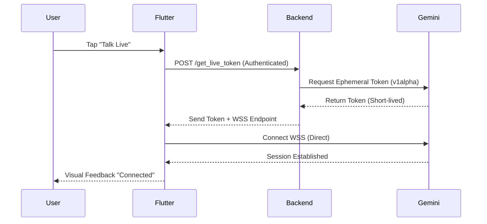

# Gemini Advanced Features Implementation Plan

This document outlines the strategy for integrating **Gemini Live API**, **Batch API**, **Context Caching**, and **Advanced File Management** into the InhausBrain ecosystem.

## 1. Architecture Overview (Non-Breaking)

The current REST-based proxy (`AIProxyService.dart` -> Python Cloud Functions) remains the primary fallback and workhorse for complex reasoning and stateful agent orchestration. The new features will be added as high-performance sidecars.

```mermaid
graph TD
    Client[Flutter Mobile/Web]
    Backend[Python Cloud Functions]
    Gemini[Gemini API v1/v1alpha]
    
    subgraph REST Proxy (Current)
        Client <-->|HTTP/Auth| Backend
        Backend <-->|SDK| Gemini
    end

    subgraph Live Stream (New)
        Client -- 1. Auth & Get Ephemeral Token --> Backend
        Backend -- 2. Create Token --> Gemini
        Gemini -- 3. Token --> Backend
        Backend -- 4. Token --> Client
        Client <-->|5. WebSocket / wss://| Gemini
    end

    subgraph Batch & Cache
        Client -- Start Job --> Backend
        Backend -- Upload Files/Cache --> Gemini
        Backend -- Poll/Notify --> Client
    end
```

---

## 2. Feature-Specific Integration Details

### A. Multimodal Live API (Client-to-Server)
This enables the "Always-On" personality of Brian with sub-200ms latency.

**Backend Setup:**
- Endpoint: `get_live_token`
- Action: Call `client.auth_tokens.create` with `live_connect_constraints` to lock the session to specific safety settings and system instructions.

**Frontend Setup:**
- Use `web_socket_channel` in Flutter.
- Real-time Audio processing (16kHz PCM).
- Tool Mapping: The client must define listeners for tool calls received over the WebSocket.

### B. Context Caching
Reduces costs and latency for large, repetitive contexts (e.g., massive property blueprints or long conversation histories).

- **Implementation**: The backend will maintain a `ContextCacheRegistry` in Firestore.
- **Trigger**: When a prompt includes large `context_data`, the service checks if a cache exists. If not, it creates one with an initial 1-hour TTL.
- **Management**: A scheduled function will refresh or cleanup expired caches.

### C. Batch API
Ideal for massive data processing (e.g., generating 100+ social media posts or analyzing 50 video clips at once).

- **Workflow**: 
  1. Frontend uploads multiple files to a "Batch Queue".
  2. Backend converts the queue into a `.jsonl` file and sends it to the Gemini Batch API.
  3. A background task polls for completion and updates the state in Firestore.

### D. Advanced File API Integration
Supports large document analysis (PDFs, Videos) without sending raw bytes repeatedly.

- **Storage Sync**: Automatically sync files from Firebase Storage to the Gemini File API for any agent task involving multimodal analysis.
- **Reference Management**: Use the `file_uri` in prompt contents to minimize payload size.

### E. Media Resolution & Quality
For multimodal tasks (Video/Images), the system will dynamically adjust resolution based on the task:
- **Low Resolution**: For general object detection or layout analysis.
- **High Resolution**: For OCR, blueprint reading, or aesthetic evaluation.

### F. Data Governance & Logging
Leveraging the [Gemini Logs & Datasets policy](https://ai.google.dev/gemini-api/docs/logs-policy), all production data will be handled as:
- **Private**: No data used for model retraining.
- **Audit Trails**: Interaction IDs will be stored in Firestore for quality monitoring and dataset generation.

---

## 3. Implementation Roadmap

### Phase 1: Infrastructure Upgrade
1.  **Security**: Define `v1alpha` API version compatibility in `GeminiClient`.
2.  **Ephemeral Tokens**: Implement `get_live_token` Python function.
3.  **Safety**: Create a centralized `SafetyConfig` class for dynamic thresholding.
4.  **Framework Alignment**: Standardize tool schemas to be compatible with **LangGraph** and **CrewAI** for complex multi-agent flows.

### Phase 2: Live Connectivity
1.  **Flutter Client**: Create `GeminiLiveClient` class to handle WebSockets and PCM audio buffers.
2.  **Tool Bridging**: Implement a mechanism to route Live API tool calls to existing Agency Agents.

### Phase 3: Efficiency & Optimization
1.  **Caching**: Implement the logic to wrap large prompts in `CachedContent`.
2.  **Batching**: Add the `BatchProcessingService` to the backend.

---

## 4. Troubleshooting & Quality Assurance

As per [Gemini Troubleshooting Guide](https://ai.google.dev/gemini-api/docs/troubleshooting):
- **CORS**: We have already addressed the primary CORS issues for REST. WebSocket connections will use the signed Direct URL which bypasses proxy CORS.
- **Token Expiry**: Automate token refreshing every 25 minutes for long Live sessions.
- **Safety**: Monitor `FINISH_REASON_SAFETY` and provide user-friendly feedback rather than empty responses.
- **Service Invocation**: For 2nd Gen functions, ensure `invoker="public"` is set in the function options to allow unauthenticated preflight requests (CORS).
- **URL Mapping**: Production URLs follow the `https://[name]-[hash]-[region].a.run.app` pattern.

---

## 5. Flowchart: Live API Session Initialization


