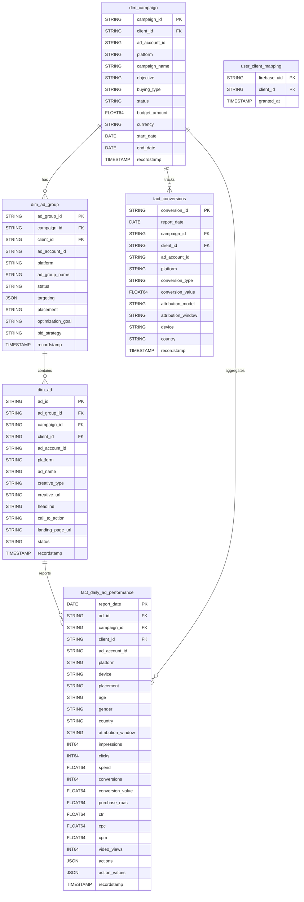

# Marketing Intelligence Warehouse

> **Phase 0** — Cortex-compatible BigQuery star schema for cross-platform ad data.
> Part of the BrainWeave Marketing Intelligence layer (BunkerDB replacement).

## Architecture

This Terraform module provisions three BigQuery datasets and a Cortex-compatible star schema that centralizes performance data from Meta, TikTok, LinkedIn, Google Ads, and GA4.

### Data Flow

```
Ad Platforms (Meta/TikTok/LinkedIn/Google Ads/GA4)
         │
         ▼
  ┌─────────────┐   Cloud Functions / BQ Data Transfer
  │ marketing_raw │   (Phase 1 ingestion)
  └─────┬───────┘
        │  Dataform (raw → CDC → staging)
        ▼
  ┌──────────────────┐
  │ marketing_staging │   Cleaned, deduplicated, typed
  └─────┬────────────┘
        │  Dataform (staging → mart)
        ▼
  ┌────────────────┐
  │ marketing_mart │   Star schema (dims + facts)
  └─────┬──────────┘
        │
        ├──► BrainWeave Agents (bigquery_query tool)
        ├──► GenUI Dashboards (MarketingIntelligencePanel)
        └──► Proposal Specialist (auto-pull live data)
```

### Star Schema (ER Diagram)



## Datasets

| Dataset | Purpose |
|---|---|
| `marketing_raw` | Raw ingested data from all platforms (retained indefinitely) |
| `marketing_staging` | Intermediate cleaned/deduplicated data (Dataform transforms) |
| `marketing_mart` | Production star schema — agents and dashboards query here |

## Row-Level Security

All tables in `marketing_mart` enforce strict data isolation mapped back to the Firebase Auth token.
- `google_bigquery_row_access_policy` is applied using the `SESSION_USER()` mapping technique. 
- BrainWeave stores the `user.uid` inside BigQuery as `firebase_uid`.
- The filter dynamically matches to `client_id` inside `user_client_mapping`.

## Apply

```bash
terraform init
terraform validate
terraform plan -var="service_account_email=YOUR_INGESTION_SA@inhausbrain.iam.gserviceaccount.com"
terraform apply -var="service_account_email=YOUR_INGESTION_SA@inhausbrain.iam.gserviceaccount.com"
```
