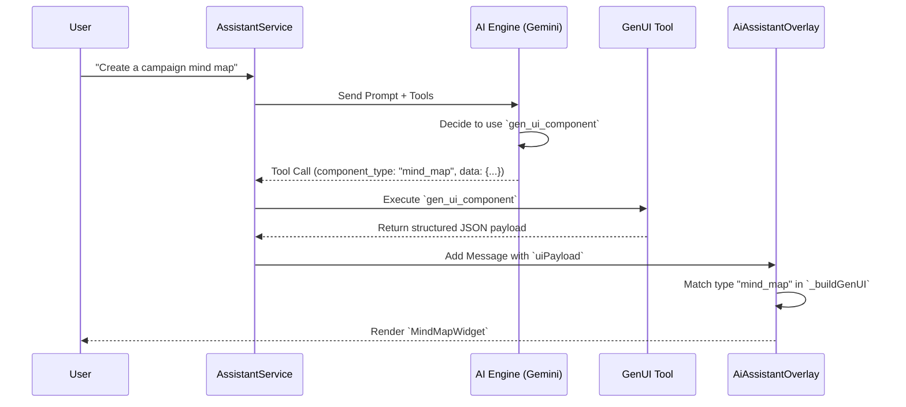
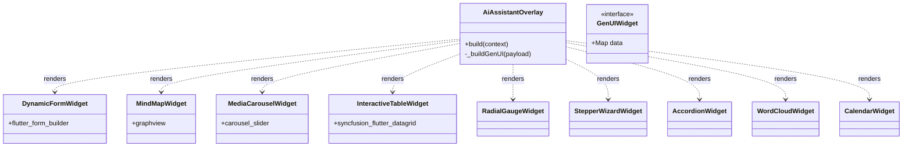
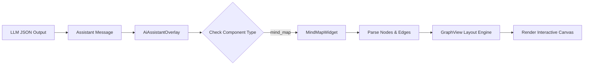

# InhausBrain
## Video Generation and Model Picker Fixes

### 1. Backend: Resolved Polling Attribute Error
- **Problem:** The `poll-operation` endpoint was returning a `500` error with the message `"'str' object has no attribute 'name'"`. This occurred because `GenerateVideosResponse` does not have standard `candidates` or `video` attributes, but instead uses `generated_videos`.
- **Solution:** 
    - Hardened `functions-python/gemini_client.py` with robust attribute access.
    - Added specific handling for `generated_videos` in `_serialize_response` to correctly extract the video URI from Veo models.
    - Added traceback logging to `main.py`'s `poll_operation` for better debugging.
- **Verification:** Redeployed backend functions to Staging. Extensive logging added to capture operation details.

### 2. Frontend: Fixed Model Picker Visibility and Layout
- **Problem:** The Model Picker was reportedly missing, likely due to browser caching of an older layout where the Voice Button was a sibling instead of a suffix icon.
- **Solution:** 
    - Updated `lib/features/chat/agentic_chat_view.dart` to move the Voice Button back to the left (matching the user's screenshot) and placed the Model Picker next to it.
    - Simplified the input decoration to avoid rendering conflicts.
- **Redeployment:** Successfully redeployed the Flutter web app to staging (`inhausbrain-beta.web.app`) using a clean build.

### 3. Workflow Improvements
- **Clean Builds:** Added `flutter clean` as the final step in both Staging and Production deployment workflows to prevent stale build artifacts.

## Verification Results
- [x] Python Backend redeployed with attribute fixes.
- [x] Flutter Web App redeployed to staging with layout updates.
- [x] Deployment workflows updated with cleanup step.

> [!TIP]
> If the Model Picker is still not visible, please perform a hard refresh (Cmd+Shift+R) in your browser to clear any cached assets.

GenUI Architecture Walkthrough

## Overview
This document visualizes the advanced Generative UI (GenUI) system v1.4, which enables the AI Assistant to render rich, interactive Flutter widgets directly in the chat stream based on user intent.

## 1. High-Level Flow
The following sequence diagram illustrates how a user request flows through the AI engine, tool execution, and final UI rendering.

## 2. Component Hierarchy
The GenUI system is built on a modular widget architecture. The `AiAssistantOverlay` acts as the central router, dispatching data to specific widget implementations.

## 3. Data Flow Example: Mind Map
When the AI generates a mind map, it constructs a JSON object that `MindMapWidget` parses into a graph structure.

## 4. Key Packages
- **Dynamic Forms**: `flutter_form_builder`
- **Charts & Gauges**: `syncfusion_flutter_gauges`
- **Data Grids**: `syncfusion_flutter_datagrid`
- **Graphs**: `graphview`
- **Carousels**: `carousel_slider`
