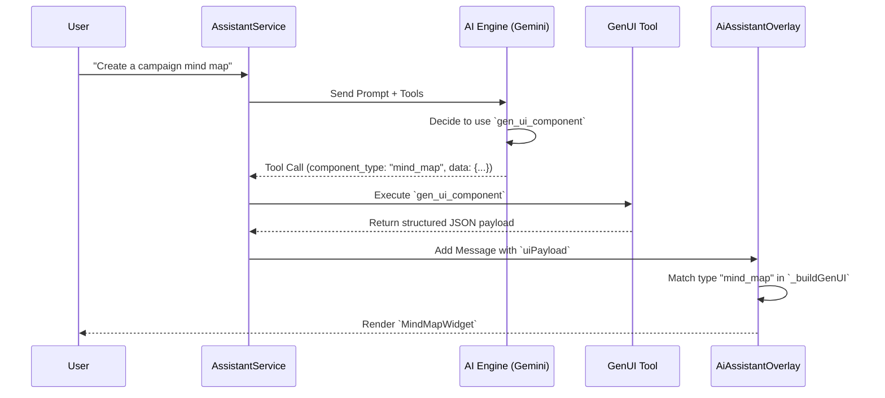
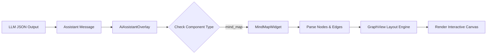

# InhausBrain GenUI Architecture Walkthrough

## Overview
This document visualizes the advanced Generative UI (GenUI) system v1.4, which enables the AI Assistant to render rich, interactive Flutter widgets directly in the chat stream based on user intent.

## 1. High-Level Flow
The following sequence diagram illustrates how a user request flows through the AI engine, tool execution, and final UI rendering.

## 2. Component Hierarchy
The GenUI system is built on a modular widget architecture. The `AiAssistantOverlay` acts as the central router, dispatching data to specific widget implementations.

## 3. Data Flow Example: Mind Map
When the AI generates a mind map, it constructs a JSON object that `MindMapWidget` parses into a graph structure.

## 4. Key Packages
- **Dynamic Forms**: `flutter_form_builder`
- **Charts & Gauges**: `syncfusion_flutter_gauges`
- **Data Grids**: `syncfusion_flutter_datagrid`
- **Graphs**: `graphview`
- **Carousels**: `carousel_slider`
