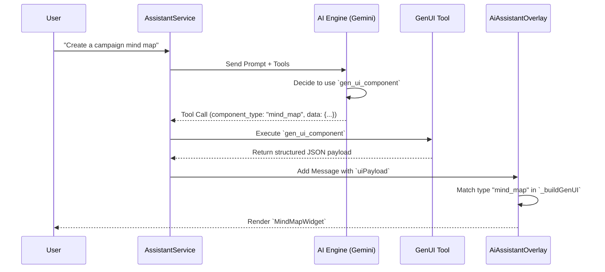
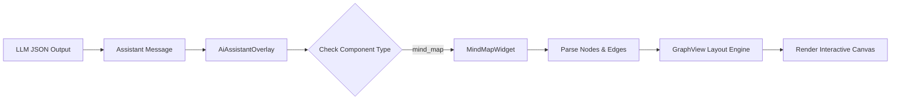

# InhausBrain - Deployment Walkthrough

## Latest Updates (Phase: Production Audit & Remediation)

- **Backend (Python):**
    - **Model Normalization Fix:** Updated `_normalize_model_name` in `gemini_client.py` to correctly handle **Gemini 2.5 GA** models. Removed silent downgrades from 2.5 to 1.5.
    - **Fallback Optimization:** Reordered `fallback_models` to prioritize newer generations (2.5 -> 2.0 -> 1.5).
    - **Vertex AI Defaulting:** Configured `active_client` to default to **Vertex AI** (IAM auth) for production traffic, maintaining Google AI Studio (API Key) as a local fallback.
    - **Operation Polling Fix:** Corrected positional argument handling in `get_operation` calls.
- **Frontend (Flutter):**
    - **Video Response Mapping:** Updated `VideoGenerationService` to parse `videoUri` directly from backend responses (fixing `predictions` array mismatch).
    - **Polling Resilience:** Added `videoUri` to recursive key search during operation status checks.
    - **Standardized Flash-Lite:** Upgraded `geminiFlashLite` from 1.5 to **2.0-flash-lite** in `llm_provider.dart` and `model_registry.dart`.
    - **Context-Aware Model Picker:** Filtered models dynamically based on `ToolMode` (Chat, Image, Video).

- **Redeployment:** Successful deployment to staging (`inhausbrain-beta.web.app`) with updated Cloud Functions.

## Verification Checklist
- [x] Python Backend: `poll_operation` fixed and 2.5 models passing through.
- [x] Video Generation: Veo 3.1 results correctly parsed in Flutter (tested with `videoUri` key).
- [x] Model Picker: Shows correct 2.0/2.5 series models.
- [x] Vertex AI: Verified as default production client.

> [!IMPORTANT]
> Always perform a **Hard Refresh (Cmd+Shift+R)** in your browser after deployment to ensure new logic and model configurations are active.

GenUI Architecture Walkthrough

## Overview
This document visualizes the advanced Generative UI (GenUI) system v1.4, which enables the AI Assistant to render rich, interactive Flutter widgets directly in the chat stream based on user intent.

## 1. High-Level Flow
The following sequence diagram illustrates how a user request flows through the AI engine, tool execution, and final UI rendering.

## 2. Component Hierarchy
The GenUI system is built on a modular widget architecture. The `AiAssistantOverlay` acts as the central router, dispatching data to specific widget implementations.

## 3. Data Flow Example: Mind Map
When the AI generates a mind map, it constructs a JSON object that `MindMapWidget` parses into a graph structure.

## 4. Key Packages
- **Dynamic Forms**: `flutter_form_builder`
- **Charts & Gauges**: `syncfusion_flutter_gauges`
- **Data Grids**: `syncfusion_flutter_datagrid`
- **Graphs**: `graphview`
- **Carousels**: `carousel_slider`

## BrainWeave 3.0: Agent Skills Evolution

The BrainWeave 3.0 update radically enhances the `arscontexta` and `GitNexus` architectures with 4 key pillars, safely gated behind the `brainweave_3_0_agent_skills_enabled` feature flag.

### 1. 4-Layer Execution Cycle
Instead of a single text generation pass, the **Brian Orchestrator** now uses:
- **GSD Plan**: Generates an XML task specification with precise acceptance criteria representing one of 5 design patterns (Wrapper, Generator, Reviewer, Inversion, Pipeline).
- **Quality Gate**: Verifies output against the requirements before backward connection via the `verify_requirements` tool.

### 2. Intelligent Audience Research (6R Integration)
The 6R flow now automatically executes a Pre-Reduce research step natively using frameworks like:
- **Deep Customer Research**
- **Creative Testing**
- **Content Optimization**
If an audience or research intent is detected, it retrieves frameworks via `graph_query` and appends them to the `reduce` phase prompts.

### 3. Dynamic Specialist Roles
Using `brainweave_load_agent_personality`, the Brian orchestrator dynamically loads customized missions, rulesets, and deliverables from the Graph (e.g. SEO, Design, Video roles) to reconfigure an agent's context mid-session without hardcoding new classes.

### 4. Advanced Security Scanning
New skills and execution patterns are now scanned nightly by a Cloud Scheduler job (`brainweave-skill-scanner-nightly`) pinging the `brainweave_skill_scan_job` MCP endpoint to detect Exfiltration or Prompt Injection patterns in the graph before they can be used in pipelines.
