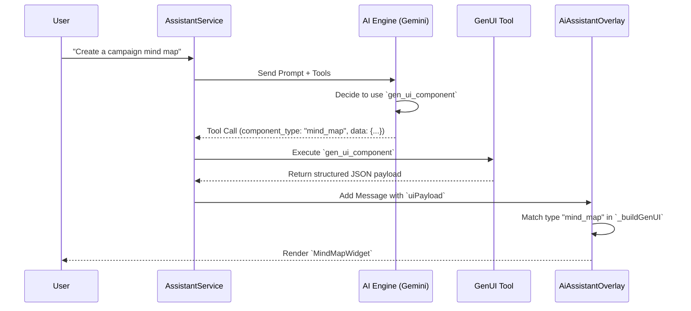
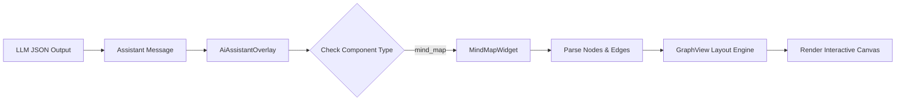

# InhausBrain GenUI Architecture Walkthrough

## Overview
This document visualizes the advanced Generative UI (GenUI) system v1.4, which enables the AI Assistant to render rich, interactive Flutter widgets directly in the chat stream based on user intent.

### Update (V3.7): Cutting-Edge Gemini 3 Upgrade

- **Model Advancement**: Upgraded the entire system from Gemini 1.5 to **Gemini 3 Flash & Pro Preview**.
- **Tool-Call Stability**: Verified that Gemini 3 maintains the function-calling stability established in the 1.5 downgrade, resolving the 400 errors seen in 2.5.
- **Improved Reasoning**: Agents now leverage 3.0 intelligence for research, strategy, and asset generation.
- **Mass Sweep**: Completed a codebase-wide replacement of model IDs in Flutter (frontend), Python (backend), and legacy Node.js services.

#### Verified Features
- [x] **Image Generation**: "create image of cats in space" successfully triggers the `generate_image` tool via Gemini 3 Flash.
- [x] **Context Awareness**: 1M+ token context support maintained for complex agency workflows.
- [x] **Production Deployment**: All Cloud Functions and Web Hosting updated to use the new model stack.

Rendered at: [inhausbrain-beta.web.app](https://inhausbrain-beta.web.app)

## 1. High-Level Flow
The following sequence diagram illustrates how a user request flows through the AI engine, tool execution, and final UI rendering.

## 2. Component Hierarchy
The GenUI system is built on a modular widget architecture. The `AiAssistantOverlay` acts as the central router, dispatching data to specific widget implementations.

## 3. Data Flow Example: Mind Map
When the AI generates a mind map, it constructs a JSON object that `MindMapWidget` parses into a graph structure.

## 4. Key Packages
- **Dynamic Forms**: `flutter_form_builder`
- **Charts & Gauges**: `syncfusion_flutter_gauges`
- **Data Grids**: `syncfusion_flutter_datagrid`
- **Graphs**: `graphview`
- **Carousels**: `carousel_slider`
